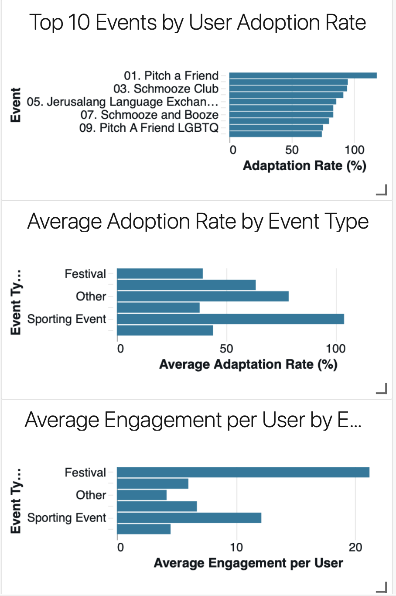
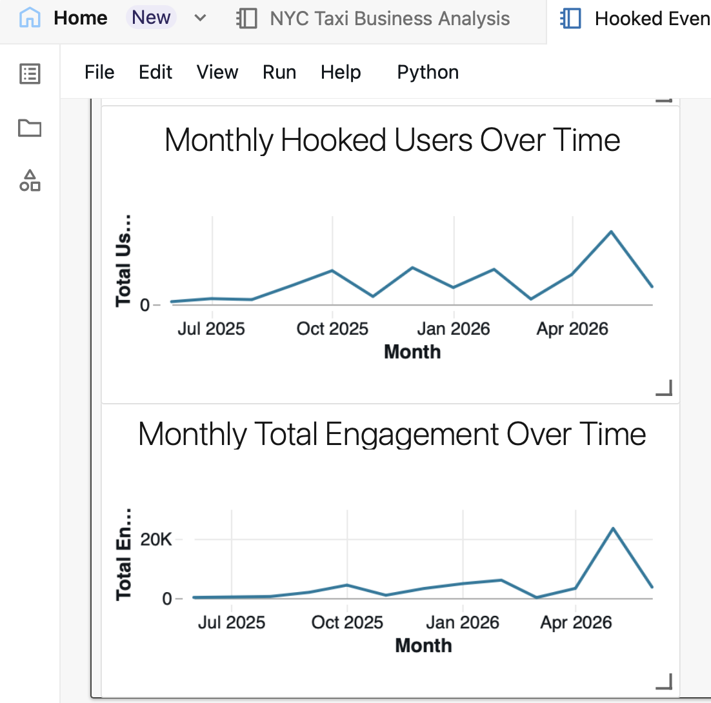

# Hooked Event Performance Analytics:
This project uses Databricks, PySpark, and Delta Lake to clean and analyze event data from Hooked.

Hooked is a dating technology platform that helps single people connect at in person events through provided QR codes.

The goal of this project was to understand which events and event types had the strongest user adoption and engagement.

## Tools used:

- Databricks
- Python
- PySpark
- Apache Spark
- Delta Lake
- Databricks dashboards

## What I did:

1. Uploaded the original event data into a Databricks volume
2. Created Bronze, Silver, and Gold data tables
3. Cleaned inconsistent city, state, country, and date values
4. Converted number columns into the correct data types
5. Marked records as complete or incomplete
6. Calculated adoption and engagement metrics
7. Compared performance across events, event types, and months
8. Built a dashboard to show the main results

## Metrics:

The main metrics used in the project were:

- Adoption rate
- Matches per user
- Messages per user
- Likes per user
- Total engagement
- Engagement per user

## Main findings:

- Sporting events had the highest average adoption rate
- Festivals had the highest average engagement per user
- Pitch a Friend had the highest individual event adoption rate
- The event types with the highest adoption were not always the same ones with the highest engagement
- User activity and engagement changed significantly from month to month
- May 2026 had a large increase in both users and engagement

## Data privacy:

The original company dataset is not included in this repository.

This repository only includes the project code and dashboard screenshots.

## Dashboard

## Files

- `hooked_event_performance_analytics.py`
- `dashboard.png`
- `.gitignore`
